##실행결과화면

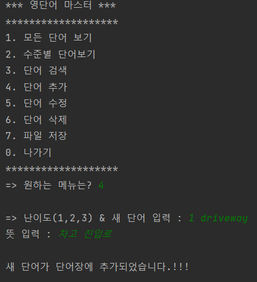

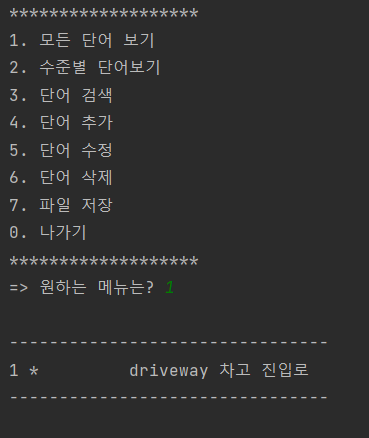

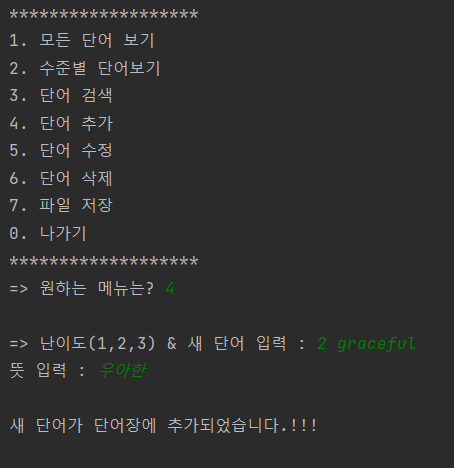

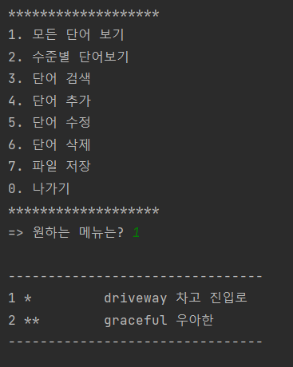

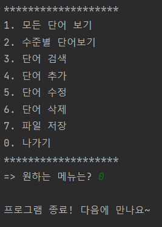

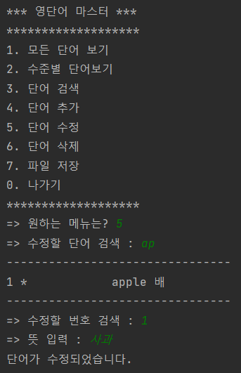

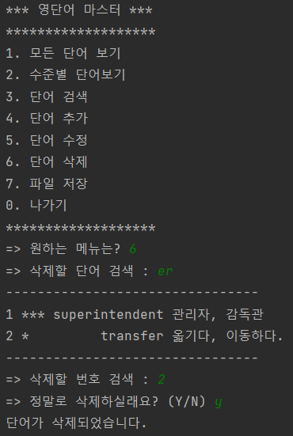

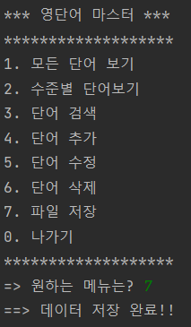

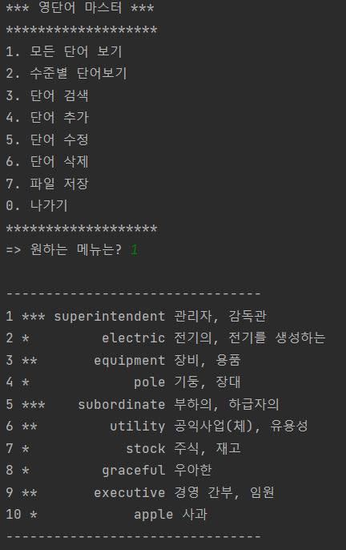

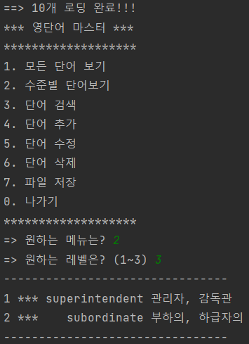

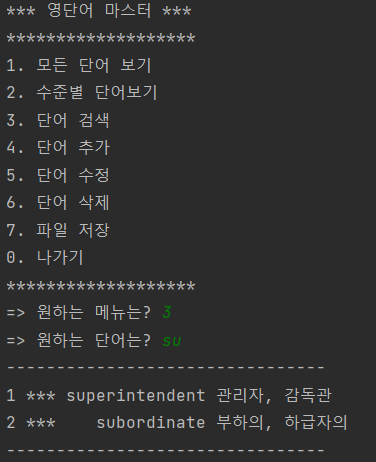

##소감, 어려움 또는 건의사항

##자바에 능숙하지 못하고 intellj와 Github를 처음 사용해서 어색했습니다.

##이번 학기 실전 프로젝트1과 자바 프로그래밍을 병행이수 중입니다. 그래도 조금씩 자바에 대한 감을 잡고 있고,
##교수님께서 말씀하신 것처럼 동영상을 보고 따라하는 것이 아닌 저 스스로 같은 기능을 하는 프로그램을 만들기 위해 더 노력하겠습니다.

